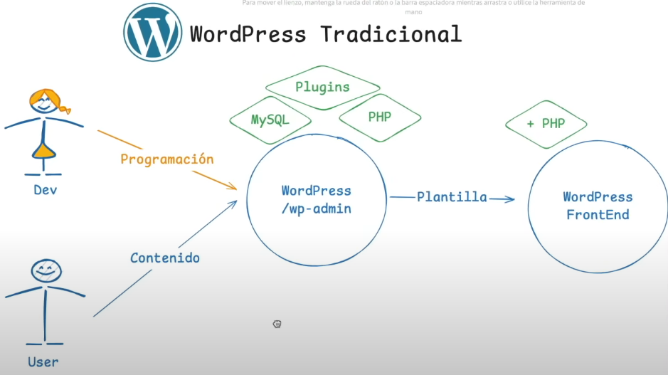

# GameHub 🎮 

## Introducción

WordPress se puede utilizar de la forma estándar de siempre o también se puede utilizar de forma **Headless.**

Es una forma de utilizar WordPress en la que separamos el Back-End del Front-End.

De forma que los datos los meteremos en WordPress y a través de una API vamos a extraer dicha información.

## ¿Qué es Headless?




## Ventajas y desventajas

La ventaja principal de trabajar así con WordPress es el desacoplamiento. Ya que la capa de presentación está separada del sistema de gestión de contenido. Por lo tanto el WordPress ya no depende del Front-End.

Por lo que podemos actualizar el Front-End y cambiar de frameworks y no pasa nada.

Y además podríamos tener más de 1 Front-End o una app nativa que también se nutra de esto.

La escalabilidad es otra ventaja.

Las desventajas son la complejidad de la implementación, puesto que requiere conocimientos adicionales de Front-End y el manejo de APIs, el SEO y el mantenimiento.

## 2 Formas de instalar WP

[Local](https://localwp.com/)

[Studio de WordPress.com](https://developer.wordpress.com/es/studio/)

## Creando un proyecto

Utilizamos la interfaz de creación de un proyecto de en mi caso el software oficial de WordPress llamado Studio. Y tras la creación si entramos aquí: [http://localhost:8881/wp-admin/](http://localhost:8881/wp-admin/) y ponemos el usuario y la contraseña que aparecen en Settings→WP Admin en Studio podemos acceder a la zona de administración de WordPress de forma local.

Una vez dentro borramos las dos páginas que se han creado por defecto:


## Creando y publicando nuestra primera página

Accedemos a la sección Pages y le damos al botón `Add Page`:


Editamos mínimamente el contenido y le damos a `Publish`.

Pero si accedemos a la página publicada veremos que la URL no es aceptable, porque la URL está utilizando una query string.


Pero a nosotros lo que nos interesa es tener slugs o permalinks que sean legibles, por un tema de SEO.

## Links legibles

Cambiamos el formato de los permalinks que por defecto aparece en `Plain` por `Post name`:


Esto es importante porque con el formato de la URL `Plain` no vamos a poder consultar los datos de la API de WordPress, porque las URLs resultantes no van a ser legibles y nos va a dificultar mucho el proceso.

Por ejemplo, podemos acceder a la información de los posts consultando la siguiente URL:

[http://localhost:8881/wp-json/wp/v2/posts](http://localhost:8881/wp-json/wp/v2/posts)

Igual que podemos consultar la información de los usuarios en esta:

[http://localhost:8881/wp-json/wp/v2/users](http://localhost:8881/wp-json/wp/v2/users)

Pero la clave es que nos quedemos con el patrón de la URL para poder hacer peticiones a la API.

<aside>


Caution

Ocultar el usuario admin no sólo en la respuesta de la API, sino en todo lugar donde sea posible ocultar dicha información.

</aside>

## Plugin de WP de GraphQL

Lo bueno es que para el tema de lidiar con los datos de la API podemos optar por instalar uno de los plugin de WordPress, concretamente existe uno llamado `WPGraphQL`.


Lo activamos.

Y usamos este código para recuperar información de la API de nuestro WordPress:

```graphql
{
  categories {
    edges {
      node {
        name
        slug
      }
    }
  }
  
  posts {
    edges {
      node {
        author {
          node {
            avatar {
              url
            }
            name
          }
        }
        date
        title
        excerpt
        content
      }
    }
  }
}
```

Pero al hacerlo nos damos cuenta de que las categorías están sin “categorizar”.


Ya que ahora mismo no tenemos ninguna categoría:


## Creando una categoría

Usamos la interfaz para crear 2 categorías:


Con esto ahora podremos hacer que las entradas tengan una categoría.

Si ahora volvemos a consultar el resultado de ejecutar el código de GraphQL anterior:


<aside>


Warning

He cambiado las categorías y las he puesto en inglés.

</aside>

## Entradas / Posts

Vamos a imaginarnos que vamos a hacer un blog de videojuegos.

Añadimos una featured image:


Y contenido a la entrada de blog:


<aside>


Note

Hemos añadido un excerpt personalizo, ya que de lo contrario tomaría el texto que se encuentra debajo del título del artículo.

</aside>

Pero claro, esto esta hecho con PHP y está usando una plantilla, es decir, de momento estamos trabajando con el WordPress de forma tradicional, pero esto no lo queremos, es decir, no queremos que el Front-End de WordPress esté disponible.

Para resolver esto existe un plugin.

## Plugin headless

Si instalamos este plugin ya no se vería la página por defecto que teníamos en nuestro sitio de WordPress puesto que realizaría una redirección.


Pero instalar este plugin no hace nada si no configuramos la constante HEADLESS_MODE_CLIENT_URL en nuestro fichero wp-config.php:


Si volvemos a consultar la información de Settings → Headless Mode:


Ahora ya vemos que está correctamente configurada la redirección.

Una alternativa a usar un plugin de WordPress sería añadir una función `disable_wp_frontend` en el archivo `functions.php` del theme:

```php
function disable_wp_frontend(){
	// If it is API or admin request, permit it	
	if (is_admin() || strpos($_SERVER['REQUEST_URI'], '/wp-json/') === 0) {
		return;
	}

	// Redirect to another page
	
	// Podemos usar get_env para recuperar la variable de entorno si estamos en producción o desarrollo 
	// get_env() 	
	wp_redirect('http://localhost:4321', 301);
	exit;
} 
```

## Creando proyecto con Astro + Tailwind

Este es el resultado tras crear el proyecto de Astro con Tailwind y añadirle algunos componentes:


Pero lo que queremos aquí es que la información venga de WordPress, de la API de WordPress, no que la hayamos puesto a mano tal y como está ahora.

## Variables de entorno

Creamos un archivo .env en la raíz del proyecto donde definimos la siguiente variable de entorno:

```jsx
WP_DOMAIN="http://localhost:8881"
```

## Página y entradas

Borramos las páginas existentes en el panel de administración de WordPress:


Creamos una nueva página de WordPress cambiando algo el contenido que pusimos antes en Astro:


La publicamos.

Una cosa importante en WordPress es que podemos configurar una página de inicio.

<aside>


Note

En WordPress una página es una página estática, simple y singular que tiene información, y ahí podríamos tener la política de privacidad, la página de inicio, la página del about, etc.

En cambio las entradas son los artículos y se agrupan por defecto como si fuesen entradas del blog. Estos pueden ser paginados, agrupados por categorías, añadirles comentarios (aunque a las páginas también, aunque normalmente donde vamos a querer comentarios es en las entradas). 

</aside>

Vamos a Settings → Reading y establecemos la página de inicio con la página que acabamos de crear.


Por lo que si visitamos ahora nuestro sitio WordPress nos muestra el contenido de la Homepage seleccionada:


## Recuperar información con Astro (API)

Creamos una nueva página con el slug `/about`:


Consultamos la información de las pages en la API de WordPress:


Usamos el slug para la URL y así obtener la información de la página que nos interesa para el inicio:


Así que vamos a crear una forma de recuperar esta información desde nuestro proyecto de Astro.

Creamos una carpeta llamada `lib` en el directorio `src` y dentro añadimos el archivo `wp.ts` :

```tsx
const domain = import.meta.env.WP_DOMAIN
const apiUrl = `${domain}/wp-json/wp/v2`

export const getPageInfo = async (slug: string) => {
  const response = await fetch(`${apiUrl}/pages?slug=${slug}`)
  if (!response.ok) {
    throw new Error("Failed to fetch page info")
  }

  const data = await response.json()
  console.log(data)

  return data
}
```

Ahora si consultamos la información que estamos obteniendo por consola, vemos entre otras cosas que tenemos a nuestra disposición el título y el contenido:


<aside>


Note

Si nos fijamos en los campos de title y content vemos que dentro tienen una propiedad llamada `rendered`, y esto es porque WordPress te viene ya renderizado con el HTML.

</aside>

Vamos a modificar el código de `wp.ts` para obtener el `title` y el `content`:

```tsx
const domain = import.meta.env.WP_DOMAIN
const apiUrl = `${domain}/wp-json/wp/v2`

export const getPageInfo = async (slug: string) => {
  const response = await fetch(`${apiUrl}/pages?slug=${slug}`)
  if (!response.ok) {
    throw new Error("Failed to fetch page info")
  }

  // const data = await response.json()
  // const { title, content } = data[0]
  // This is a desctructuring assignment to extract title and content from the first element of the data array,
  // but we can use the first option that I have commented out above
  const [data] = await response.json()
  const { title: {rendered: title}, content: {rendered: content} } = data

  return { title, content } 
}
```

Modificamos el código de la page `index.astro` para renderizar el título y el contenido recibido desde la API de WordPress:

```tsx
---
import Layout from '../layouts/Layout.astro';
import GameCard from '../components/GameCard.astro';
import { getPageInfo } from '../lib/wp.ts';

const featuredPosts = [
	{
		title: 'The Latest Gaming Trends of 2025',
		excerpt: "Discover what's shaping the gaming industry this year, from AI-driven narratives to revolutionary gameplay mechanics.",
		featuredImage: "https://images.unsplash.com/photo-1486572788966-cfd3df1f5b42?q=80&w=2072&auto=format&fit=crop&ixlib=rb-4.1.0&ixid=M3wxMjA3fDB8MHxwaG90by1wYWdlfHx8fGVufDB8fHx8fA%3D%3D",
		date: "April 1, 2024",
		slug: "gaming-trends-2024"
	},
	{
		title: 'Top 10 Must-Play Indie Games of 2024',
		excerpt: "Explore the most exciting indie games that are making waves in the gaming community this year.",
		featuredImage: "https://images.unsplash.com/photo-1517841905240-472988babdf9?q=80&w=2072&auto=format&fit=crop&ixlib=rb-4.1.0&ixid=M3wxMjA3fDB8MHxwaG90by1wYWdlfHx8fGVufDB8fHx8fA%3D%3D",
		date: "March 15, 2024",
		slug: "must-play-indie-games-2024"
	},
	{
		title: 'The Evolution of Game Graphics: A Journey Through Time',
		excerpt: "Take a look back at how game graphics have evolved from pixel art to hyper-realistic visuals.",
		featuredImage: "https://images.unsplash.com/photo-1506748686214-e9df14d4d9d0?q=80&w=2072&auto=format&fit=crop&ixlib=rb-4.1.0&ixid=M3wxMjA3fDB8MHxwaG90by1wYWdlfHx8fGVufDB8fHx8fA%3D%3D",
		date: "February 20, 2024",
		slug: "evolution-of-game-graphics",
	}
]

const {title,content} = await getPageInfo("welcome-everyone-to-gamehub") 
---

<Layout title="GameHub - Your Ultimate Gaming Destination">
	<section class="bg-black text-white py-20">
		<div class="container mx-auto px-4 text-center">
			<h1 class="text-5xl font-bold mb-6">{title}</h1>
			<p class="text-xl max-w-2xl mx-auto">
				{content}
			</p>
		</div>
	</section>

	<section class="container mx-auto px-4 py-12">
		<h2 class="text-3xl font-bold mb-8 text-center">Latest Articles</h2>
		<div class="grid grid-cols-1 md:grid-cols-2 lg:grid-cols-3 gap-8">
			{featuredPosts.map((post) => <GameCard {...post} />)}
		</div>
	</section>
</Layout>
```

Ahora si consultamos el contenido de nuestra página principal veremos que el contenido está siendo cargado, pero nos aparece una `<p>`  y esto se debe a que el contenido viene ya renderizado como hemos mencionado anteriormente.

En este caso, tenemos dos opciones, podríamos quitarle al contenido todas la etiquetas HTML, pero esto no tiene mucho sentido. O lo que deberíamos hacer realmente que es fiarnos de que lo que va a devolver es contenido que deberíamos ser capaces de renderizar.

<aside>


Caution

Esto lo podremos hacer siempre que sea contenido controlado por nosotros. No se puede hacer esto con contenido que esté poniendo un usuario. 

</aside>

```tsx
---
import Layout from '../layouts/Layout.astro';
import GameCard from '../components/GameCard.astro';
import { getPageInfo } from '../lib/wp.ts';

const featuredPosts = [
	{
		title: 'The Latest Gaming Trends of 2025',
		excerpt: "Discover what's shaping the gaming industry this year, from AI-driven narratives to revolutionary gameplay mechanics.",
		featuredImage: "https://images.unsplash.com/photo-1486572788966-cfd3df1f5b42?q=80&w=2072&auto=format&fit=crop&ixlib=rb-4.1.0&ixid=M3wxMjA3fDB8MHxwaG90by1wYWdlfHx8fGVufDB8fHx8fA%3D%3D",
		date: "April 1, 2024",
		slug: "gaming-trends-2024"
	},
	{
		title: 'Top 10 Must-Play Indie Games of 2024',
		excerpt: "Explore the most exciting indie games that are making waves in the gaming community this year.",
		featuredImage: "https://images.unsplash.com/photo-1517841905240-472988babdf9?q=80&w=2072&auto=format&fit=crop&ixlib=rb-4.1.0&ixid=M3wxMjA3fDB8MHxwaG90by1wYWdlfHx8fGVufDB8fHx8fA%3D%3D",
		date: "March 15, 2024",
		slug: "must-play-indie-games-2024"
	},
	{
		title: 'The Evolution of Game Graphics: A Journey Through Time',
		excerpt: "Take a look back at how game graphics have evolved from pixel art to hyper-realistic visuals.",
		featuredImage: "https://images.unsplash.com/photo-1506748686214-e9df14d4d9d0?q=80&w=2072&auto=format&fit=crop&ixlib=rb-4.1.0&ixid=M3wxMjA3fDB8MHxwaG90by1wYWdlfHx8fGVufDB8fHx8fA%3D%3D",
		date: "February 20, 2024",
		slug: "evolution-of-game-graphics",
	}
]

const {title,content} = await getPageInfo("welcome-everyone-to-gamehub") 
---

<Layout title="GameHub - Your Ultimate Gaming Destination">
	<section class="bg-black text-white py-20">
		<div class="container mx-auto px-4 text-center">
			<h1 class="text-5xl font-bold mb-6">{title}</h1>
			<div class="text-xl max-w-2xl mx-auto" set:html={content} />
		</div>
	</section>

	<section class="container mx-auto px-4 py-12">
		<h2 class="text-3xl font-bold mb-8 text-center">Latest Articles</h2>
		<div class="grid grid-cols-1 md:grid-cols-2 lg:grid-cols-3 gap-8">
			{featuredPosts.map((post) => <GameCard {...post} />)}
		</div>
	</section>
</Layout>

```

Y con esto ahora si se muestra la información adecuadamente:


## Mostrar los últimos artículos

Ahora lo que queremos es mostrar los artículos que tenemos en WordPress, concretamente teníamos este:


Para ello añadimos esta función en el archivo `wp.ts`:

```tsx
export const getLatestPosts = async ({perPage = 10}: {perPage?: number} = {}) => {
  const response = await fetch(`${apiUrl}/posts?per_page=${perPage}`)
  if (!response.ok) throw new Error("Failed to fetch latest posts")

  const results = await response.json()
  if (!results.length) throw new Error("No posts found")

  console.log(results)

  return results
}
```

Y la usamos en `index.astro` :

```tsx
---
import Layout from '../layouts/Layout.astro';
import GameCard from '../components/GameCard.astro';
import { getPageInfo, getLatestPosts } from '../lib/wp.ts';

const featuredPosts = [
	{
		title: 'The Latest Gaming Trends of 2025',
		excerpt: "Discover what's shaping the gaming industry this year, from AI-driven narratives to revolutionary gameplay mechanics.",
		featuredImage: "https://images.unsplash.com/photo-1486572788966-cfd3df1f5b42?q=80&w=2072&auto=format&fit=crop&ixlib=rb-4.1.0&ixid=M3wxMjA3fDB8MHxwaG90by1wYWdlfHx8fGVufDB8fHx8fA%3D%3D",
		date: "April 1, 2024",
		slug: "gaming-trends-2024"
	},
	{
		title: 'Top 10 Must-Play Indie Games of 2024',
		excerpt: "Explore the most exciting indie games that are making waves in the gaming community this year.",
		featuredImage: "https://images.unsplash.com/photo-1517841905240-472988babdf9?q=80&w=2072&auto=format&fit=crop&ixlib=rb-4.1.0&ixid=M3wxMjA3fDB8MHxwaG90by1wYWdlfHx8fGVufDB8fHx8fA%3D%3D",
		date: "March 15, 2024",
		slug: "must-play-indie-games-2024"
	},
	{
		title: 'The Evolution of Game Graphics: A Journey Through Time',
		excerpt: "Take a look back at how game graphics have evolved from pixel art to hyper-realistic visuals.",
		featuredImage: "https://images.unsplash.com/photo-1506748686214-e9df14d4d9d0?q=80&w=2072&auto=format&fit=crop&ixlib=rb-4.1.0&ixid=M3wxMjA3fDB8MHxwaG90by1wYWdlfHx8fGVufDB8fHx8fA%3D%3D",
		date: "February 20, 2024",
		slug: "evolution-of-game-graphics",
	}
]

const {title,content} = await getPageInfo("welcome-everyone-to-gamehub") 
const posts = await getLatestPosts({perPage: 3})
---
```

Entonces, de los resultados extraídos vamos a querer recuperar el título, la fecha, el excerpt, el content, el slug y la imagen. El problema es que la imagen no aparece directamente en los resultados devueltos, lo único que aparece es `featured_media: 17` .


Y ahora renderizamos los posts de WordPress, en lugar de los estáticos que habíamos creado anteriormente:

```tsx
---
import Layout from '../layouts/Layout.astro';
import GameCard from '../components/GameCard.astro';
import { getPageInfo, getLatestPosts } from '../lib/wp.ts';

const {title,content} = await getPageInfo("welcome-everyone-to-gamehub") 
const posts = await getLatestPosts({perPage: 3})
---

<Layout title="GameHub - Your Ultimate Gaming Destination">
	<section class="bg-black text-white py-20">
		<div class="container mx-auto px-4 text-center">
			<h1 class="text-5xl font-bold mb-6">{title}</h1>
			<div class="text-xl max-w-2xl mx-auto" set:html={content} />
		</div>
	</section>

	<section class="container mx-auto px-4 py-12">
		<h2 class="text-3xl font-bold mb-8 text-center">Latest Articles</h2>
		<div class="grid grid-cols-1 md:grid-cols-2 lg:grid-cols-3 gap-8">
			{posts.map((post: any) => <GameCard {...post} />)}
		</div>
	</section>
</Layout>
```

Pero al ver el resultado vemos que hay algún problema con el excerpt que hemos renderizado usando el componente `GameCard.astro` :


Así que vamos a solucionarlo (he cambiado el contenido del excerpt):


## ¿Por qué no se renderiza la imagen?

Como hemos podido ver respecto a la obtención de la imagen, únicamente tenemos el id. Pero si nos fijamos en `_links`  nos indica cómo deberíamos recuperar este `featuremedia` :


Se nos informa de que tenemos que hacer una llamada a esta URL para recuperar la información del `featuremedia` y te lo devuelve.

Lo podríamos hacer manualmente, es decir, hacer primero una llamada a la API y luego otra llamada a la API.

¿Cuál es el problema de esto?

Pues que es un poco rollo, donde empiezas a tener una cascada donde una cosa depende de otra.

Una solución puede ser añadir en la URL de la petición fetch un parámetro `embed` que hace que todos los objetos que están digamos incrustados en nuestro post, nos va a otorgar esa información directamente sin necesidad de tener que ir a buscar en la API dicha información.

Este es el resultado ahora y como vemos al final del todo nos aparece un bloque `_embedded` donde tenemos la información del autor, los comentarios (replies) y también el `featuremedia` y el `term`.

```tsx
[
  {
    id: 1,
    date: '2025-05-07T02:15:27',
    date_gmt: '2025-05-07T02:15:27',
    guid: { rendered: 'http://localhost:8881/?p=1' },
    modified: '2025-05-15T15:08:16',
    modified_gmt: '2025-05-15T15:08:16',
    slug: 'hello-world',
    status: 'publish',
    type: 'post',
    link: 'http://localhost:8881/hello-world/',
    title: { rendered: 'New GTA VI trailer!' },
    content: {
      rendered: '\n' +
        '<p>Rocktstar Games has released a second trailer of Grand Theft Auto 6 and these are our impressions.</p>\n' +
        '\n' +
        '\n' +
        '\n' +
        '<p><strong>Vice City is back—and louder than ever.</strong> Rockstar Games has just released the long-awaited <strong>second trailer for Grand Theft Auto VI</strong>, and predictably, the internet has collectively lost its mind. Between shouts of <em>&#8220;Game of the Century!&#8221;</em> and obsessive frame-by-frame breakdowns on YouTube, one thing is clear: Rockstar knows exactly how to keep the world on a leash.</p>\n' +
        '\n' +
        '\n' +
        '\n' +
        '<h2 class="wp-block-heading">What Does the New Trailer Show?</h2>\n' +
        '\n' +
        '\n' +
        '\n' +
        '<p>The second trailer dives deeper into what fans suspected after the first teaser dropped back in December 2023: a gritty, adrenaline-fueled story set in a reimagined, modern-day <strong>Vice City</strong>, blending the chaos of open-world freedom with the emotional weight of a <strong>Bonnie-and-Clyde-style duo</strong>.</p>\n' +
        '\n' +
        '\n' +
        '\n' +
        '<figure class="wp-block-image"></figure>\n' +
        '\n' +
        '\n' +
        '\n' +
        '<p>We see <strong>Lucia</strong>, the game’s first female protagonist in the series, in action again—this time with more personality, more danger, and a lot more explosions. Her partner-in-crime is still unnamed, but their chemistry? Think Netflix crime drama meets high-speed heist simulator.</p>\n' +
        '\n' +
        '\n' +
        '\n' +
        '<p>Visually, the trailer is <em>insane</em>. Florida vibes, neon lights, swampy backroads, social media parodies, gators on the loose—it’s Rockstar flexing its worldbuilding muscles. But underneath all the cinematic shots, fast cars, and radio chatter, a few key takeaways stand out:</p>\n' +
        '\n' +
        '\n' +
        '\n' +
        '<ul class="wp-block-list">\n' +
        '<li><strong>The world feels alive.</strong> We&#8217;re talking real-time news broadcasts, viral challenges, and NPCs reacting like they actually have a Twitter account.</li>\n' +
        '\n' +
        '\n' +
        '\n' +
        '<li><strong>The satire is sharper.</strong> Rockstar seems to be leaning hard into mocking influencer culture, political absurdity, and the &#8220;Florida Man&#8221; phenomenon.</li>\n' +
        '\n' +
        '\n' +
        '\n' +
        '<li><strong>The detail is jaw-dropping.</strong> From sweaty t-shirts to dynamic weather, the devs clearly aren’t pulling punches.</li>\n' +
        '</ul>\n' +
        '\n' +
        '\n' +
        '\n' +
        '<h2 class="wp-block-heading">So&#8230; Should We Believe the Hype?</h2>\n' +
        '\n' +
        '\n' +
        '\n' +
        '<p>Here’s the thing—<strong>Rockstar hasn’t missed in over a decade.</strong> From GTA V to Red Dead Redemption 2, their polish and storytelling are top-tier. But it’s 2025, and the gaming world is different now. Players are skeptical. Studios overpromise. Launches flop. Delays happen. NFTs get thrown in for no reason (don’t get ideas, Rockstar).</p>\n' +
        '\n' +
        '\n' +
        '\n' +
        '<p>Still, there’s something about GTA VI that feels…inevitable. If even half of what this trailer teases comes true, we might be looking at the next cultural milestone in gaming. Or, worst case, a glorified TikTok simulator with guns. Either way, we’ll be playing it.</p>\n',
      protected: false
    },
    excerpt: {
      rendered: '<p>The second trailer dives deeper into what fans suspected after the first teaser dropped back in December 2023: a gritty, adrenaline-fueled story set in a reimagined, modern-day Vice City, blending the chaos of open-world freedom with the emotional weight of a Bonnie-and-Clyde-style duo.</p>\n',
      protected: false
    },
    author: 1,
    featured_media: 13,
    comment_status: 'open',
    ping_status: 'open',
    sticky: false,
    template: '',
    format: 'standard',
    meta: { footnotes: '' },
    categories: [ 1 ],
    tags: [],
    class_list: [
      'post-1',
      'post',
      'type-post',
      'status-publish',
      'format-standard',
      'has-post-thumbnail',
      'hentry',
      'category-inicio'
    ],
    _links: {
      self: [Array],
      collection: [Array],
      about: [Array],
      author: [Array],
      replies: [Array],
      'version-history': [Array],
      'predecessor-version': [Array],
      'wp:featuredmedia': [Array],
      'wp:attachment': [Array],
      'wp:term': [Array],
      curies: [Array]
    },
    _embedded: {
      author: [Array],
      replies: [Array],
      'wp:featuredmedia': [Array],
      'wp:term': [Array]
    }
  }
]
```

Y es que si accedemos a esta URL de la API de WordPress indicando que queremos el contenido embedded podemos ver la URL de la imagen en el campo `source_url` :


**wp.ts**

```tsx
const domain = import.meta.env.WP_DOMAIN
const apiUrl = `${domain}/wp-json/wp/v2`

export const getPageInfo = async (slug: string) => {
  const response = await fetch(`${apiUrl}/pages?slug=${slug}`)
  if (!response.ok) {
    throw new Error("Failed to fetch page info")
  }

  // const data = await response.json()
  // const { title, content } = data[0]
  // This is a desctructuring assignment to extract title and content from the first element of the data array,
  // but we can use the first option that I have commented out above
  const [data] = await response.json()
  const { title: {rendered: title}, content: {rendered: content} } = data

  return { title, content } 
}

export const getLatestPosts = async ({perPage = 10}: {perPage?: number} = {}) => {
  const response = await fetch(`${apiUrl}/posts?per_page=${perPage}&_embed`)
  if (!response.ok) throw new Error("Failed to fetch latest posts")

  const results = await response.json()
  if (!results.length) throw new Error("No posts found")

  console.log(results)

  const posts = results.map((post: any) => {

    // This is the simplified version of the above code
    const {
      title: { rendered: title },
      excerpt: { rendered: excerpt },
      content: { rendered: content },
      date,
      slug
    } = post

    const featuredImage = post._embedded["wp:featuredmedia"][0].source_url

    return {title, excerpt, content, date, slug, featuredImage}
  })

  return posts 

```

## Preguntas de la comunidad 2

¿El rendimiento al estar usando esa API de WordPress no es muy pesado?

Si que puede ser pesado y por ello existe la opción de utilizar GraphQL para sacar sólo la información que nos interesa, pero también podríamos cachearlo o generar los estáticos.

También se puede optimizar en el fichero `functions.php`  y decirle qué campos son los que quieres devolver.

Si entramos en el artículo para ver la URL veremos lo siguiente:


Y como vemos el slug es `hello-world` , pero esto lo podemos cambiar. Y tenía este valor porque se basa en el primer título que tenía el artículo.


## Agregando nuevas entradas

Vamos a añadir más posts desde WordPress.

De forma que ahora tenemos 3 posts:


Pero la pregunta del millón ahora es que si entramos en cualquiera de los posts vemos esto:


Y es que no tenemos la información del post.

¿Cómo podemos acceder ahí?

## Dynamic routes

Creamos una función para extraer el contenido de los posts en el archivo `wp.ts` 

```tsx
export const getPostInfo = async (slug: string) => {
  const response = await fetch(`${apiUrl}/posts?slug=${slug}`)

  if (!response.ok) throw new Error("Failed to fetch post info")

  const [data] = await response.json()
  const { title: {rendered: title}, content: {rendered: content} } = data

  return { title, content } 
}
```

 y la utilizamos para renderizar dicho contenido en una nueva page dentro del nuevo directorio `src/pages/post` llamada `[slug].astro` .

```tsx
---
import Layout from "../../layouts/Layout.astro";
import GameCard from "../../components/GameCard.astro";
import { getPostInfo } from "../../lib/wp.ts";

const slug = Astro.params.slug;
if (!slug) return Astro.redirect("/404"); 

const { title, content } = await getPostInfo(slug);
---
<Layout title={title}>
  <article>
    <h1>{title}</h1>
    <div class="text-xl max-w-2xl mx-auto" set:html={content} />
  </article>
</Layout>
```

Pero si probamos a acceder a nuestro de los posts:


Esto es un problema más de Astro que podríamos arreglar activando el modo servidor.

Pero en nuestro caso vamos a utilizar el `getStaticPaths()` .

Porque tú imagínate que lo que quieres es crear una página estática, pero que utilice WordPress por debajo, por ejemplo para landing pages, que lo que quieres es que el cliente pueda cambiar títulos, descripciones, contenido, lo que tú quieras pero quieres que la página sea estática y que se tenga que volver a desplegar, es decir, construyes una vez la web y ya no tiene que ir más a la base de datos, sino que cada vez que la desplegamos está toda la información estática y ya está.

En un blog puede no tener tanto sentido porque cada vez que publicas se tiene que volver a desplegar, pero es interesante saber cómo se hace.

En este caso tenemos que saber todas las rutas que tiene que crear antes de que podamos compilarlas, es decir, en este caso se nos está indicando “oye, necesito saber todos los paths estáticos, o sea, todos los artículos que tengo que ir a buscar a la base de datos antes de poder ver la página, o sino, vas a tener que poner el modo servidor”.

Si lo quisiéramos en modo servidor, simplemente tenemos que poner la línea de código `export const prerender = false;`  en el archivo `[slug].astro`  y poner en el archivo `astro.config.mjs` lo de `output: 'server'` .

## Recuperar todas las rutas

Pero en nuestro caso como queremos ver cómo se haría con rutas estáticas.

Creamos una nueva función en el archivo `wp.ts`  

```tsx
export const getAllPostsSlugs = async () => {
  const response = await fetch(`${apiUrl}/posts?per_page=100`)
  if (!response.ok) throw new Error("Failed to fetch posts slugs")

  const results = await response.json()
  if (!results.length) throw new Error("No posts found")

  const slugs = results.map((post: any) => post.slug)
  console.log(slugs)
  return slugs
}
```

Y usamos dicha función en el archivo `[slugs].astro` 

```tsx
---
import Layout from "../../layouts/Layout.astro";
import { getAllPostsSlugs, getPostInfo } from "../../lib/wp.ts";

const slug = Astro.params.slug
if (!slug) return Astro.redirect("/404") 

export async function getStaticPaths() {
  const slugs = await getAllPostsSlugs()
  console.log(slugs)
  return slugs.map((slug: any) => ({ params: { slug } }))
}

const { title, content } = await getPostInfo(slug)
---
```

Si nos fijamos en la consola podemos ver todas las entradas y las URLs repetidas que tenemos que generar gracias a los dos `console.log(slugs)` que hemos puesto arriba:


<aside>


Warning

Esto no tiene sentido hacerlo para un blog que tenga por ejemplo 5000 entradas porque tardaría demasiado en compilar y haría 5000 peticiones a la base de datos.

</aside>

Esta manera de proceder puede tener sentido en una landing que tenga 15-20 páginas que no sean muchas, si estamos hablando de un periódico, un blog, algo que tenga demasiados resultados, no vale la pena hacer esto.

En cambio, en contenidos que sean pequeños, que cambian muy de vez en cuando y tal pues tiene más sentido hacer esto.

Por el contrario, si es un contenido que cambia mucho, que es muy dinámico, que es muy grande, pues no tiene sentido hacer esto y es mejor activar el modo servidor.

Y finalmente para arreglar la UI un poquito, es instalar el famoso plugin de TailwindCSS de typography con `npm install -D @tailwindcss/typography`  y después únicamente tenemos que indicar en el fichero `global.css`  que queremos utilizar dicho plugin:

```scss
@import "tailwindcss";
@plugin "tailwindcss/typography";
```

## SEO

Uno de los problemas que tenemos actualmente, es que no tenemos nada de SEO.

Una de las cosas que podríamos hacer para solucionar esto es instalar el plugin de  “yoast”:


Este plugin lo que va a hacer es que ahora las entradas van a tener como un bloque totalmente nuevo donde vamos a poder añadir títulos, descripciones, mejorar el SEO, etiquetas, etc.

Realizamos la configuración inicial:


Ahora al entrar a editar cualquiera de nuestros posts veremos las opciones de modificación del SEO disponibles:


Vamos a añadir una meta description por ejemplo:


Y lo segundo que tiene este plugin que es muy interesante es que automáticamente, sin necesidad de hacer absolutamente nada, si miramos la información que recuperamos del post veremos que tenemos más información disponible.

Por ejemplo en la información recibida del post del Metro 4:


Además de la información general sobre el SEO proporcionada por el plugin de yoast:


Así que vamos a recuperar la información del SEO de cada post añadiendo esto a la función `getPostInfo()`  del archivo `wp.ts` :

```scss
export const getPostInfo = async (slug: string) => {
  const response = await fetch(`${apiUrl}/posts?slug=${slug}`)

  if (!response.ok) throw new Error("Failed to fetch post info")

  const [data] = await response.json()
  const { title: {rendered: title}, content: {rendered: content}, yoast_head_json: seo } = data

  return { title, content, seo } 
}
```

Recuperamos el seo en la página de cada post `[slug].astro` y pasamos la descripción como prop al layout:

```scss
---
import Layout from "../../layouts/Layout.astro";
import { getAllPostsSlugs, getPostInfo } from "../../lib/wp.ts";

// Explicitly type Astro.params to avoid TypeScript errors
const slug = (Astro.params as { slug?: string }).slug;
if (!slug) return Astro.redirect("/404") 

export async function getStaticPaths() {
  const slugs = await getAllPostsSlugs()
  console.log(slugs)
  return slugs.map((slug: any) => ({ params: { slug } }))
}

const { title, content, seo } = await getPostInfo(slug)
---
<Layout title={title} description={seo.description}>
  <article class="prose max-w-2xl mx-auto my-16">
    <h1>{title}</h1>
    <div set:html={content} />
  </article>
</Layout>
```

Si ahora accedemos al post de Metro 4 veremos que está usando la descripción que pusimos antes en el plugin de yoast:


Además desde WordPress podemos cambiar todo el tema de los metadatos, el SEO, el título, descripción, el open graph, twitter, etc.

Todo desde un sólo sitio, con el content management system de WordPress.

## Últimas palabras

En dondominio por ejemplo existe la opción de crear subdominios, lo cual puede ser muy interesante para tener el wordpress en un sudbominio y el frontend en otro.

Respecto a la seguridad de la API de WordPress, se puede mantener el WordPress en privado para que no sea accesible al público y que sólo se pueda acceder desde servidor, lo cual es la aproximación correcta. E incluso una cosa interesante es que podemos hacer que sólo se pueda acceder con JSON web token, que tengamos que utilizar un token para las llamadas de la API.

Por esto último hemos comentado anteriormente que es algo peligroso que la API de WordPress esté tan abierta, por ello la idea sería cerrarla y que sólo podamos acceder a ella con un JSON web token.

Más que nada, no porque haya información sensible, sino para que no te intenten scrapear el contenido y no te intenten hacer que los recursos te salgan bastante caros. 

Por último, respecto al despliegue del Front-End, lo podemos hacer en Vercel, Netlify, DonDominio entre otros, porque con un `npm run build`   nos podemos generar los archivos estáticos.

En cambio si queremos que sea dinámico, entonces sí vamos a tener que meterlo en algún sitio que sea un servidor.